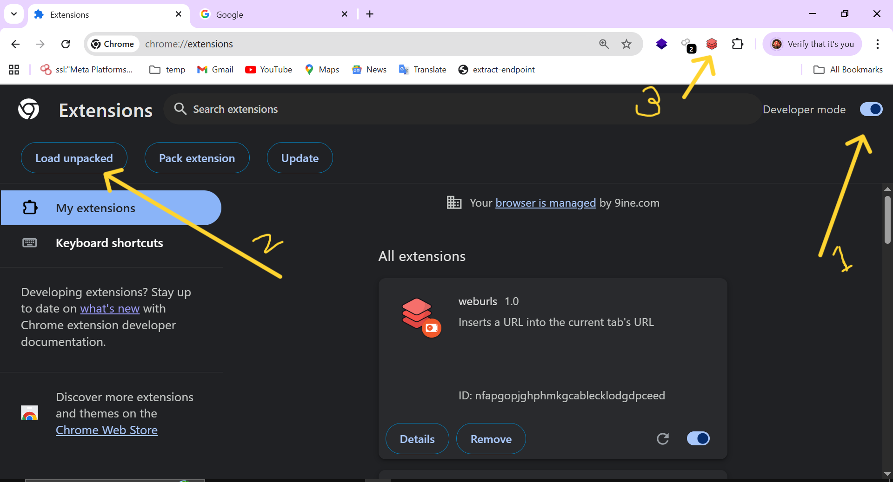
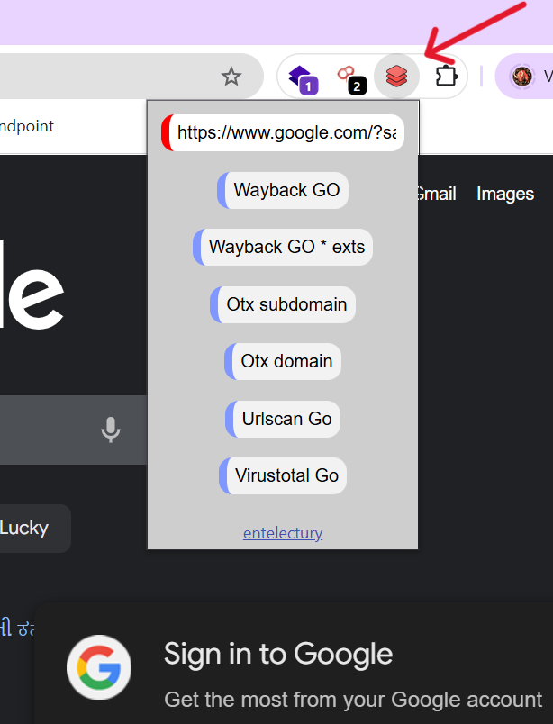

# WebURLs - URL Gathering Tool

WebURLs is a tool that helps you **gather URLs from a website quickly** using multiple open-source sources like **WBU, VirusTotal, URLScan.io, etc.**.  
It allows you to view URLs without opening a terminal, making reconnaissance faster and easier.

---

## Features
- Gather URLs from multiple sources at once
- Quick and easy to use without opening the terminal
- Supports WBU, VirusTotal, URLScan.io, and more
- Visual representation with images for clarity

--------

# Usage

 - Open the extension.
 - Enter the target website URL.
 - Click on any extractor to View the URLS.
 - View the URLs directly in the Browser without opening a terminal.

---------

## Installation

1. Linux
```bash
git clone https://github.com/enterlectury/weburls.git
cd weburls
nano popup.js (replace your virustotal key at line 51)
Load package on Chrome 
```
<br>

2. Window
 ```bash
   Download ZIP File
   Unzip and Add Your Virustotal Api Key on popup.js at Line51
   Load this pakage on Chrome
````

<!-- Smaller image using width -->

<br>


   
-----------------------


